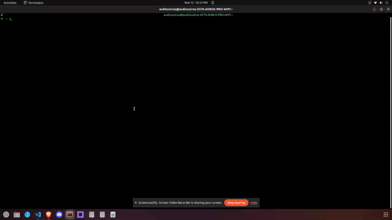
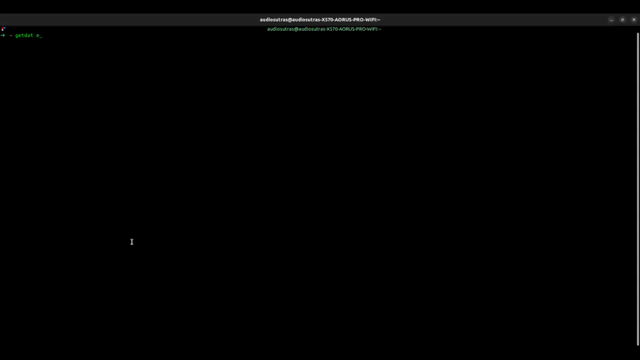

<div align="center">
    <h1>GetDat</h1>
    <p><i>A command line utility for getting resources available online</i></p>
    
    <p align="center">
        <a href="https://iv.ggtyler.dev/watch?v=4b8P8cqc-UQ" target="_blank">
            GetDat Theme Music
        </a>
    </p>
</div>


## Installation Methods

Install using `pipx`:

```bash
-> python3 -m pip install --user pipx
-> python3 -m pipx ensurepath
-> pipx install git+https://github.com/Audiosutras/getdat.git
```

## Commands

#### [Cinema](#cinema)

#### [Ebook](#ebook)

## Cinema
Launches [movie-web.app](https://movie-web.app/search/movie) in your default browser

<div align="center">
    
</div>

```bash
-> getdat cinema
```

## Ebook
Search and download an ebook available through [Anna's Archive](https://annas-archive.org/). You can think of this command as "headless" Anna's Archive

<div align="center">
    
</div>

* The demo for this command downloaded an epub format of Robert Louis Stevenson's and N.C. Wyeth's book *Treasure Island*. This book is in the public domain.
* The demo for this command opens the downloaded ebook using [epr](https://github.com/wustho/epr), a terminal epub reader to show the contents of the downloaded book. You can expect higher ebook quality by using a desktop e-reader like [librum](https://librumreader.com/)
* Anna's Archive `SciDB` search is not yet supported.


```bash
-> getdat ebook [OPTIONS] [Q]
```

#### ARGUMENTS

| Name | Help |
|------|------|
| Q    | Search |

Example:
```bash
-> getdat ebook "Treasure Island Stevenson"
```
or
```bash
-> getdat ebook Treasure Island Stevenson
```

#### OPTIONS

| Name | Convention 1 | Convention 2 | Type | Help |
| ---- | ------------ | ------------ | ----| ----|
| Output Directory | -o | --output_dir | Text | Path to ebook's output directory from home directory. Path must be prefixed by `~` on Unix or `~user` on Windows. This argument overrides `GETDAT_BOOK_DIR` env var if set. Outputs book to working directory if neither are set.
| Extension | -e | --ext | [epub | pdf] | Preferred ebook extension for search results

Example:
```bash
-> getdat ebook Treasure Island Stevenson --ext=epub --output_dir=~/books/epub/
```
or
```bash
-> getdat ebook "Treasure Island Stevensonn" -e epub -o ~/books/epub
```

#### Environment Variable

- `GETDAT_BOOK_DIR` - Path from home directory to destination directory. Ignored if `--output_dir` is specified as an [option](#options)

## Local Development

Python Version: `3.11`. To install python on MacOS & Debian-based systems
```bash
-> sudo apt install software-properties-common
-> sudo add-apt-repository ppa:deadsnakes/ppa
-> sudo apt update
-> sudo apt install python3.11
```

This python package uses [poetry](https://python-poetry.org/docs/) for dependency management. To install:
```bash
# install pipx if you have not already
-> python3 -m pip install --user pipx
-> python3 -m pipx ensurepath
# install poetry
-> pipx install poetry
```

Assuming that you have *forked the repository* and have a copy on your local machine. Within the `getdat` directory, install dependencies and open a `virtualenv` shell managed by poetry.
```bash
-> poetry install
-> poetry shell
(getdat-py3.11) ->
```

To run/develop the cli program.
```bash
(getdat-py3.11) -> getdat
Usage: getdat [OPTIONS] COMMAND [ARGS]...

  A command line utility for getting resources available online

Options:
  --help  Show this message and exit.

Commands:
  cinema  Launches movie-web.app in your default browser
  ebook   Search and download an ebook available through Anna's Archive...

  Check out our docs at https://github.com/Audiosutras/getdat/docs for more
  details

```

Project uses [pytest](https://docs.pytest.org/en/7.4.x/) for unit testing. Test run quickly with the help of [pytest-mock](https://pytest-mock.readthedocs.io/en/latest/usage.html)
```bash
(getdat-py3.11) -> pytest -v
```

Style guide and code check enforced with [pre-commit](https://pre-commit.com/)
```
(getdat-py3.11) -> pre-commit install
```

## Contributors


